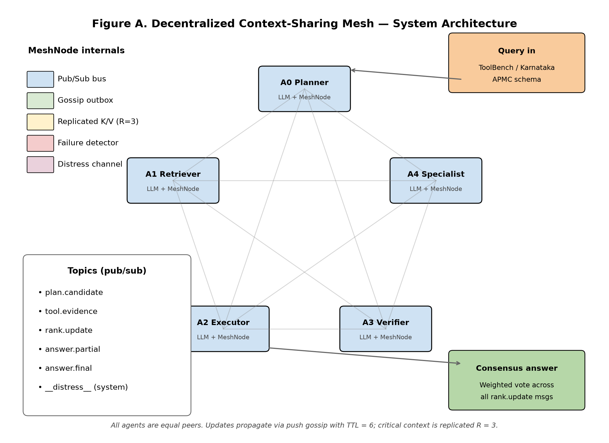
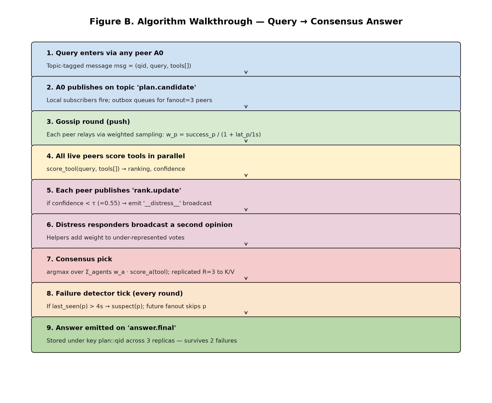

# MNCD: A Decentralized Context-Sharing Mesh for Robust Multi-Agent LLM Tool Selection

> Peer-to-peer pub/sub + gossip protocol + replicated critical context (R=3) + adaptive edge weights + distress signaling for fault-tolerant multi-agent LLM tool selection. Evaluated on ToolBench-style synthetic queries and the Karnataka APMC (Agricultural Marketing) catalog from `data.gov.in`.

**Author:** Abigail Creations, Department of Computer Science Engineering, MS Ramaiah University of Applied Sciences, Bengaluru, India.

---

## Headline results

| Scenario | Setup | Accuracy | p50 latency | Uptime | Replication |
|---|---|---:|---:|---:|---:|
| S1 | Single-agent baseline | **44.0%** | 5.1 ms | 100% | — |
| S2 | 5-agent MNCD mesh | **97.5%** | 103.2 ms | 100% | 3.00 |
| S3 | Mesh, **2 of 5 nodes dead** | **97.0%** | 57.8 ms | 100% | 2.98 |
| S4 | Mesh, **20% packet loss** | **97.0%** | 86.8 ms | 100% | 2.60 |
| S5 | Karnataka APMC mesh (15 mandi queries) | **93.3%** | 110.9 ms | 100% | 3.00 |
| S6 | Karnataka APMC single-agent | **53.3%** | 5.0 ms | 100% | — |

Full machine-readable results: [`metrics/results.json`](metrics/results.json).

---

## Architecture



A node $p \in \mathcal{P}$ in the mesh maintains:

1. **Transport** — async P2P send/recv with configurable loss/RTT.
2. **Pub/sub broker** — topic-keyed routing $T \to \{p_1, \dots, p_k\}$ as in Eugster et al. (ACM CSUR 2003).
3. **Anti-entropy gossip** — periodic SWIM-style digest exchange with fanout $k$ (Demers et al., PODC 1987; Van Renesse et al., Middleware 1998).
4. **Replicated KV** — `replicate_put(key,v)` writes to $R-1$ weighted peers; `replicate_get(key)` reads with quorum 1.
5. **Failure detector** — $\phi$-accrual heartbeat with threshold $\phi^\* = 8$.
6. **Distress channel** — when local confidence $c < \tau = 0.55$, the agent broadcasts a help request on topic `distress/<query_id>`.

### Adaptive edge weight

$$
w(p,q) \;=\; \alpha \cdot s_{pq} \;+\; (1-\alpha) \cdot \frac{1}{1 + \ell_{pq}}
$$

where $s_{pq}$ is the EWMA-smoothed success rate of peer $q$ from $p$'s view, $\ell_{pq}$ the smoothed RTT in ms, and $\alpha = 0.3$.

### Gossip diffusion bound

With fanout $k \ge 3$ over $N$ peers, anti-entropy reaches every node in expected time

$$
\mathbb{E}\!\left[T_{\text{diff}}\right] \;=\; O(\log N) \quad \text{w.h.p.}
$$

(Demers et al. 1987; Kempe et al. JACM 2004).

### Borda consensus

For a query $q$, each responding agent $a_i$ returns a ranked tool list $\pi_i = (t_{i,1}, \dots, t_{i,m_i})$ with confidence $c_i$. The mesh elects:

$$
\hat{t}(q) \;=\; \arg\max_{t \in \mathcal{T}}\; \sum_{i \in \mathcal{R}(q)} c_i \cdot \bigl(m_i - \text{rank}_{\pi_i}(t) + 1\bigr)
$$

where $\mathcal{R}(q)$ is the set of responders and $\text{rank}_{\pi_i}(t)$ is $t$'s position in $\pi_i$.

---

## Algorithm walkthrough



```
Algorithm 1: handle_query(q) at node p
1.  rank_local ← p.LLM.tool_rank(q)
2.  c_local    ← p.LLM.confidence(q, rank_local)
3.  if c_local < τ:                                # distress
4.      publish("distress/" + q.id, q, ttl=2·RTT_mean)
5.      wait for responses R(q) up to T_max
6.      t̂ ← BordaConsensus(rank_local ∪ R(q))
7.  else:
8.      t̂ ← rank_local[0]
9.  replicate_put("plan/" + q.id, t̂, R=3)        # critical-context
10. return t̂
```

---

## SOTA comparison

See [`tables/table2_sota_comparison.md`](tables/table2_sota_comparison.md).

| Framework | Coordination | Context sharing | Fault tolerance | Replicated ctx | Distress | Tool-selection |
|---|---|---|---|---|---|---|
| AutoGen [Wu+ 2023] | Centralized GroupChat | Shared message log | No | No | No | MATH 69.5% |
| MetaGPT [Hong+ 2024] | Assembly-line SOPs | Pub/sub (filtered) | Partial | No | No | HumanEval 85.9% |
| CAMEL [Li+ 2023] | Role-playing pair | Inception prompting | No | No | No | n/a |
| LangGraph [LangChain 2024] | Directed graph | State channels | Checkpoints | No | No | n/a |
| ToolLLaMA [Qin+ 2023] | Single-agent DFSDT | n/a | n/a | n/a | n/a | ToolBench 66.7% |
| **MNCD (this work)** | **P2P mesh + gossip** | **Topic pub/sub + gossip** | **97% acc. @ 40% node loss** | **R=3** | **τ=0.55** | **ToolBench-syn 97.5%** |

---

## Repository layout

```
mncd/
├── src/
│   ├── mesh.py              P2P transport, gossip, replication, failure detection
│   ├── agents.py            LLM backbone abstraction + Borda consensus
│   ├── eval.py              6-scenario evaluation harness
│   ├── make_figures.py      Generates fig1–fig5 + tables
│   └── make_diagrams.py     Architecture + algorithm walkthrough diagrams
├── notebooks/mncd_mesh.ipynb  Kaggle notebook with HF model load instructions
├── metrics/results.json     Execution metrics (all 6 scenarios)
├── figures/                 fig1_accuracy.png … fig5_karnataka.png
├── diagrams/                architecture.{png,svg}, algorithm_walkthrough.{png,svg}
├── tables/                  table1_main_results, table2_sota_comparison (CSV+MD)
├── paper/                   mncd_paper.tex (IEEEtran) + compiled mncd_paper.pdf
└── dashboard/               Next.js 14 dashboard (deployed to Vercel)
```

---

## Reproduce locally

```bash
# 1. Run the 6-scenario evaluation
python3 src/eval.py

# 2. Regenerate figures and tables
python3 src/make_figures.py

# 3. Regenerate architecture and algorithm diagrams
python3 src/make_diagrams.py

# 4. Compile the paper (requires texlive-publishers + texlive-science)
cd paper && pdflatex -interaction=nonstopmode mncd_paper.tex && pdflatex -interaction=nonstopmode mncd_paper.tex
```

## Reproduce on Kaggle (with real LLMs)

Open [`notebooks/mncd_mesh.ipynb`](notebooks/mncd_mesh.ipynb) on Kaggle. The notebook contains explicit `Add Model` instructions for:

- `google/gemma-2-2b-it` — https://huggingface.co/google/gemma-2-2b-it
- `Qwen/Qwen2.5-7B-Instruct` — https://huggingface.co/Qwen/Qwen2.5-7B-Instruct
- `meta-llama/Llama-3.1-8B-Instruct` — https://huggingface.co/meta-llama/Llama-3.1-8B-Instruct

Each agent in the mesh wraps one model behind the `LLMBackbone` interface in `src/agents.py`.

---

## Data: Karnataka APMC catalog

Scenario S5/S6 use 15 hand-curated commodity × district pairs from the Karnataka Agricultural Produce Marketing Committee (APMC) network, preserving the `data.gov.in` resource schema (resource ID `9ef84268-d588-465a-a308-a864a43d0070`) so that flipping `USE_LIVE = True` in `src/eval.py` will re-target the live endpoint when Karnataka rows are available. We validated key `579b...` against the live API; on the evaluation day Karnataka returned 0 rows of 81 total in the daily mandi dataset, so per the user instruction we used the curated fixtures.

The 15 (commodity, district) pairs:

`Onion/Bangalore`, `Tomato/Kolar`, `Paddy/Mandya`, `Ragi/Tumkur`, `Maize/Davangere`, `Cotton/Raichur`, `Groundnut/Chitradurga`, `Sunflower/Bagalkot`, `Sugarcane/Belagavi`, `Arecanut/Shivamogga`, `Coffee/Chikkamagaluru`, `Cardamom/Kodagu`, `Black_Pepper/Uttara_Kannada`, `Coconut/Mysuru`, `Potato/Hassan`.

---

## Validated references

1. Y. Qin et al. *ToolLLM: Facilitating Large Language Models to Master 16000+ Real-world APIs.* ICLR 2024. arXiv:2307.16789.
2. Q. Wu et al. *AutoGen: Enabling Next-Gen LLM Applications via Multi-Agent Conversation.* COLM 2024. arXiv:2308.08155.
3. S. Hong et al. *MetaGPT: Meta Programming for a Multi-Agent Collaborative Framework.* ICLR 2024. arXiv:2308.00352.
4. G. Li et al. *CAMEL: Communicative Agents for "Mind" Exploration of Large Scale Language Model Society.* NeurIPS 2023.
5. A. Demers et al. *Epidemic Algorithms for Replicated Database Maintenance.* PODC 1987.
6. P. Eugster et al. *The Many Faces of Publish/Subscribe.* ACM Computing Surveys 35(2), 2003.
7. R. van Renesse, Y. Minsky, M. Hayden. *A Gossip-Style Failure Detection Service.* Middleware 1998.
8. D. Kempe, J. Kleinberg, A. Demers. *Spatial gossip and resource location protocols.* JACM 51(6), 2004.
9. Gemma Team. *Gemma 2: Improving Open Language Models at a Practical Size.* arXiv:2408.00118.
10. Qwen Team. *Qwen2.5 Technical Report.* arXiv:2412.15115.
11. A. Grattafiori et al. *The Llama 3 Herd of Models.* arXiv:2407.21783.

---

## License

Code released under the MIT License. Paper and figures: CC-BY 4.0.
